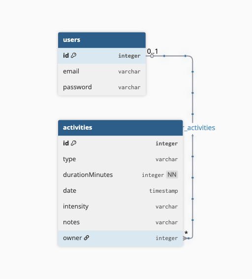

# API de Registro de Actividad Física

Esta aplicación proporciona endpoints para el registro de usuarios, autenticación y gestión de actividades físicas.  
Permite registrar el tipo de actividad, duración, fecha, intensidad y notas opcionales.

***

### Características principales

- Registro e inicio de sesión de usuarios.  
- CRUD completo de actividades físicas.  
- Validación de intensidad mediante un modelo enumerado.  
- Campos protegidos para propiedad de usuario.

***

### Modelo Entidad-Relacion



### Endpoints

#### Autenticación

- **POST /auth/sign-up**  
  Crea un nuevo usuario con credenciales de acceso.

- **POST /auth/sign-in**  
  Inicia sesión y devuelve un token de autenticación.

#### Actividades

- **GET /activities**  
  Obtiene todas las actividades del usuario autenticado.

- **GET /activities/:id**  
  Obtiene una actividad específica por ID.

- **POST /activities**  
  Crea una nueva actividad.  
  Ejemplo de cuerpo de solicitud:
  ```json
  {
    "type": "Correr",
    "durationMinutes": 45,
    "date": "2025-11-02T08:30:00Z",
    "intensity": "Alta",
    "notes": "Carrera matutina"
  }
  ```

- **PATCH /activities/:id**  
  Actualiza los datos de una actividad existente.

- **DELETE /activities/:id**  
  Elimina una actividad por ID.

***

### Requisitos

- Node.js 24 o superior  
- Base de datos compatible con TypeORM PostgreSQL  
- Variables de entorno configuradas para conexión y JWT

***

### Instalación y uso

1. Clonar el repositorio:
   ```bash
   git clone https://github.com/SantiagoBedoyaU/pdm-final-project-be.git
   cd pdm-final-project-be
   ```

2. Instalar dependencias:
   ```bash
   pnpm install
   ```

3. Configurar las variables de entorno:
   ```bash
   touch .env
   # Editar .env con las credenciales correctas
   PORT=8080
   DB_HOST=
   DB_PORT=5432
   DB_USER=
   DB_PASSWORD=
   DB_DBNAME=
   JWT_SECRET=superSecreto1$
   ```

4. Ejecutar migraciones y levantar el servidor:
   ```bash
   pnpm run build
   pnpm run start:dev
   ```

5. Abrir la API en:
   ```
   http://localhost:8080
   ```

***

### Licencia

Este proyecto está bajo la licencia MIT.  

***
